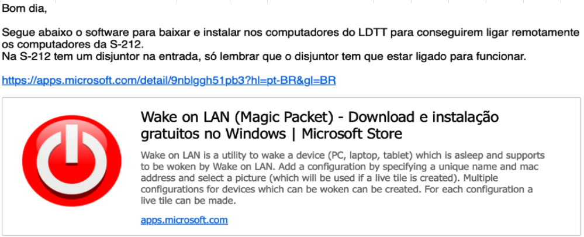
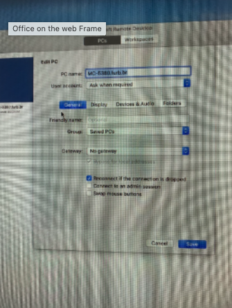

# Laboratórios

Ramal: 484 - Bruno
VPN se for WIFI

[reservasala@furb.br](mailto:reservasala@furb.br)  

```markdown
Bom dia, Bruno,

Em relação ao laboratório S-212, poderias…

__ Liberar o acesso:
  Nome_Bolsista (cod. Pessoa: XXXXX)

At.te.
```

MacOS ______
$ brew install wakeonlan
$ wakeonlan -i 192.168.1.255 -p 1234 01:02:03:04:05:06
<https://apps.microsoft.com/detail/9nblggh51pb3?hl=pt-BR&gl=BR>

  
  

## Laboratório S-212

### PCs

| PCs     | Mac Adress          | Softwares               |
|---------|---------------------|-------------------------|
| MC-5810 | 74-56-3C-F2-C3-FE   | Unity 6 .. .29          |
| MC-5811 | 74-56-3C-F2-C4-8B   | Unity 6 .. .29          |
| MC-5818 | 74-56-3C-F2-C4-1A   | Unity 6 .. .29 Insta360 |
| MC-5820 | 74-56-3C-F2-C0-95   | Unity 6 .. .29          |
| MC-5821 | 74-56-3C-F2-C0-8D   | Unity 6 .. .28 Sketch   |
| MC-5824 | 74-56-3C-F2-C4-1D   | Unity 6 .. .29          |
| MC-5827 | 74-56-3C-F2-C3-A3   | Unity 6 .. .29          |
| MC-5831 | 74-56-3C-F2-C4-82   | Unity 6 .. .29          |
| MC-5833 | 74-56-3C-F2-C0-9B   | Unity 6 .. .28          |

### Bolsistas S-212

| Bolsista                             | Matrícula | PC       |
|--------------------------------------|-----------|----------|
| Bernardo Chiamolera                  | 216991    | MC-5810  |
| Bruno Fischer Ferreira Santos        | 182004    | MC-5831  |
| Cauã Fernando Bertolini              | 225109    | MC-5824  |
| Dalton Solano dos Reis               | 7830      | MC-5833  |
| Gabriel Jorge Utyama de Carvalho     | 213724    | MC-5818  |
| João Paulo de Lima                   | 220263    | MC-5821  |
| Mateus Dassoler Spezia               | 221505    |          |
| Matheus Gamba De Oliveira            | 216209    | MC-5811  |
| Venâncio Domingos Cassua             | 223190    | MC-5820  |
| Vinícius do Espírito Santo Lopes     | 227193    | MC-5827  |

## Laboratório S-409

### PCs

| PCs     | Mac Adress          | Softwares               |
|---------|---------------------|-------------------------|
| MC-5681 |                     | Android Studio          |
| MC-5683 |                     | Android Studio          |
| MC-5685 |                     | Android Studio          |
| MC-5687 |                     | Android Studio          |
| MC-5688 |                     | Android Studio          |

### Bolsistas S-409

| Bolsista                             | Matrícula | PC       |
|--------------------------------------|-----------|----------|
| João Paulo de Lima                   |           | MC-5681  |
| Cauã Fernando Bertolini              |           | MC-5683  |
| Mateus Dassoler Spezia               |           | MC-5685  |
| Ana Clara Lopes Hostins              |           | MC-5687  |
| Gustavo Henrique Luiz                |           | MC-5688  |
| Venâncio Domingos Cassua             |           | MC-5696  |

## Laboratório R-129

### PCs com Adobe Illustrator

| PC       | Software           |
|----------|--------------------|
| MC-5380  | Adobe Illustrator  |
| MC-5383  | Adobe Illustrator  |
| MC-5385  | Adobe Illustrator  |


### Bolsistas R-129

| Bolsista                        | Matrícula | PC       |
|---------------------------------|-----------|----------|
| Ayumi Takehara Lewandowski      | 193150    | MC-5383  |
| Caroline Lucini                 | 219874    | MC-5385  |
| Lucas Hong Lae Son              | 207629    | MC-5380  |
