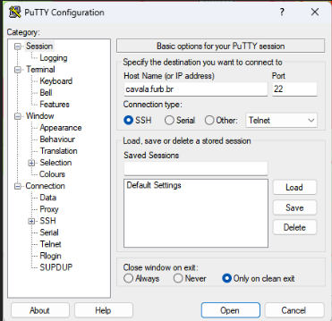

# Servidor Cavala

Servidor do LDTT  

## Permissões

Dalton Solano dos Reis (dalton@furb.br)  
Jorge Guilherme Kohn (jkohn@furb.br)  
Luciana Pereira de Araújo Kohler (lpa@furb.br)  
Luiz Henrique Martendal (lhmartendal@furb.br)  
Vinícius Estrázulas Mattos (vemattos@furb.br)  

Emanuel Girardi (esgirardi@furb.br)  
Felipe Krieger Buche (fbuche@furb.br)  
Leonardo Linhares Silva (leonardolinhares@furb.br)  
Marlon Sbardelatti (msbardelatti@furb.br)  

### Conectar

Pra se conectar, vc pode usar qualquer cliente SSH (por exemplo o Putty no Windows). No MAC pode ser usado um cliente SSH via linha de comando no terminal. De qualquer forma, esses são os dados de conexão:  

  

```terminal
> ssh -p 22 dalton@cavala.furb.br  
```

### Acesso  

> [!IMPORTANT]
> Conectar via VPN antes, caso vc esteja fora da FURB  

#### SSH: permitir

Script acesso /home/FURB/dalton/scripts:  
[concede_acesso.bash](concede_acesso.bash)  

```terminal
sudo ./concede_acesso.bash username_do_usuario
```

#### SSH: remover

Tirar a permissão de acesso via SSH:

```terminal
sudo gpasswd -d username_do_usuario ssh_logon
```

#### SSH: listar

```terminal
sudo getent group ssh_logon
```

dalton
jkohn
lhmartendal
lpa
msbardelatti
vemattos

vandeir
vanedu
vanedu_teste

### Docker

#### docker: permitir

Permissão total ao docker e seus contêineres, pode usar este comando:  

```terminal
> sudo usermod -a -G docker username_do_usuario
```

#### docker: remover

Tirar a permissão de acesso ao docker:  

```terminal
> sudo gpasswd -d username_do_usuario docker
```

#### docker: listar

```terminal  
sudo getent group docker  
```  

dalton
jkohn
lhmartendal
lpa
vemattos

vandeir
vanedu
