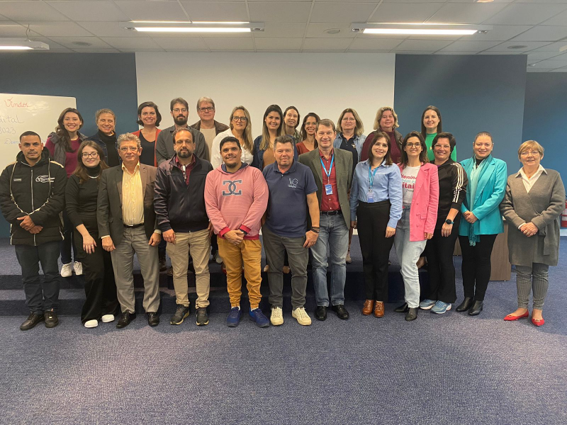
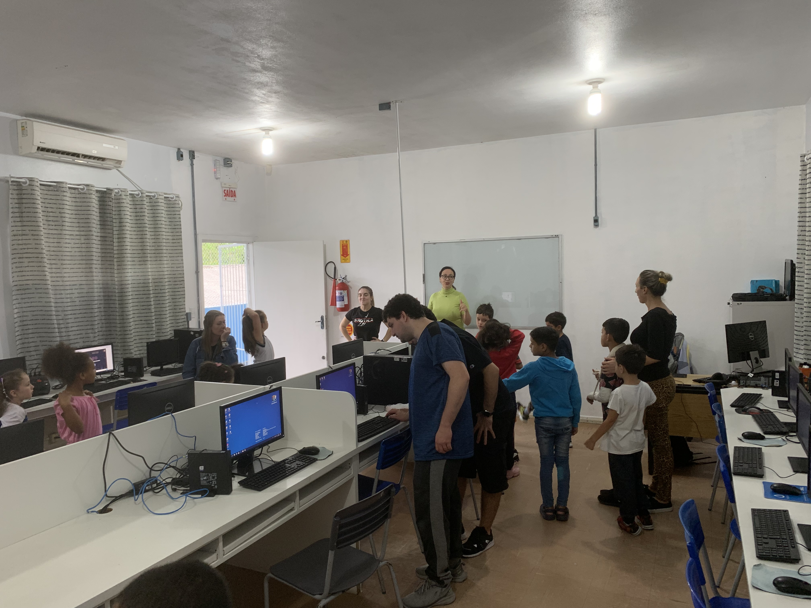

# Materiais do LDTT

## 2023-07-20 - Tímbo

[Tapete Furbot](2023-07-14_Timbo.mov)  

## 2023-07-20 - Lançamento Furbot ACIB

  

<video src="2023-07-20_Video.mp4" controls title="Vídeo"></video>  

[Apresentação](2023-07-20_apresentacao.pdf)

<video src="2023-07-20_Instagram.mp4" controls title="2023-07-20_Instagram"></video>  

<video src="2023-07-20_NDTV.mp4" controls title="2023-07-20_NDTV"></video>  

----

## 2023-08-11 - Robô

<video src="2023-08-11_Robo.mp4" controls title="2023-08-11_Robo"></video>  

## 2023-08-19 - CRAS

[2023-08-19_CRAS](./2023-08-19_CRAS/ "2023-08-19_CRAS")  

## 2023-08-25 - FFM

  

## 2023-09-26 - OdtGame

Oficina para avaliar os minigames do projeto Odonto Game na escola junto com a profa. Márcia (Odontologia) na escola Escola Básica Municipal Profª Hella Altenburg.  

  
<video src="2023-09-26_OdtGame_b.mp4" controls title="2023-09-26_OdtGame_b"></video>  
<video src="2023-09-26_OdtGame_c.mp4" controls title="2023-09-26_OdtGame_c"></video>  

## 2023-10-04 - MIPE

[2023-10-04_MIPE](2023-10-04_MIPE.pdf "2023-10-04_MIPE")  

## 2023-10-16 - 13:46

<video src="2023-10-16_LDTT_institucional.mp4" controls title="2023-10-16_LDTT_institucional.mp4"></video>  
